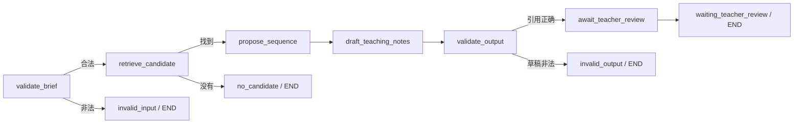

# A2｜LangGraph 实现说明

更新：2026-09-16。状态：确定性工作流已接入并完成本机工程回归；A3 已在此图中增加检索上下文节点，详见 [A3说明](A3_RAG_NOTES.md)。开发者本人理解与教师审核尚未验收。

## 为什么这里使用 LangGraph

备课不是一次文本生成。输入可能不合法、题目可能不存在、草稿可能引用错题，最终还必须由教师确认。A2 把这些状态和分支写成显式工作流，后续可替换单个节点，而不用改动 API 返回的备课对象。

当前没有大模型。LangGraph 节点可以只运行普通 Python；这能先验证流程边界，再在模型评测阶段替换需要生成能力的节点。

## 当前数据流

主实现是 [workflow.py](../backend/app/workflow.py)。`WorkflowState` 使用 `TypedDict`，其中 `trace` 使用 reducer 逐节点追加；状态只放字典、列表、字符串和数字等可序列化数据。题目查找与几何投影拆到 [catalog.py](../backend/app/catalog.py)，避免工作流与业务服务互相循环引用。

[service.py](../backend/app/service.py) 调用图并把成功状态重新校验为 Pydantic `LessonPlan`。找不到题目仍映射为原有 404；其他不可交付状态映射为明确的工作流错误。前端只消费稳定的 LessonPlan，并额外展示执行轨迹和“等待教师确认”。

## 节点契约

- `validate_brief`：Pydantic 校验请求。失败进入 `invalid_input`，不继续找题。
- `retrieve_candidate`：按稳定题目 ID 取得已存在题目。没有候选进入 `no_candidate`，不返回空草稿。
- `propose_sequence`：读取显式题间关系，不让模型编造题号。
- `draft_teaching_notes`：使用固定模板组织先做、理解、回题三个阶段；这是 Mock 草稿节点，后续可以替换实现。
- `validate_output`：重新验证结构，并检查三个阶段引用同一题、阶段顺序完整、关联题不指向自身。
- `await_teacher_review`：将状态设为 `waiting_teacher_review`。它不等于 `approved`。

## 已验证边界

后端测试覆盖成功路径、候选不存在、输入非法、跨题引用以及原有投影/API行为。成功输出还经过 JSON 往返检查，防止图状态夹带不可序列化对象。

## A2 交付时没有实现

- 没有 LLM、prompt、tool calling、LangChain agent 或自动选题。
- 没有 checkpointer、thread ID、进程重启恢复或真正的 interrupt/resume。当前“等待教师确认”是业务终态，不是可恢复中断。
- 没有教师批准接口；因此任何草稿都不会变为 `approved`。
- A2 交付时没有 RAG；A3 已加入可追溯的关键词/标签检索基线，但仍没有 embedding 或生成模型。
- 没有数据库、并发编辑或旧运行结果防覆盖机制。

这些限制留给后续阶段。A3 用检索器替换固定候选来源；A4 再引入业务持久化、修订和可恢复的人审流程，避免用内存 checkpoint 冒充上线级数据保存。
